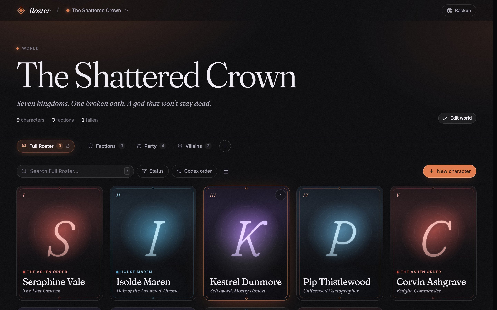
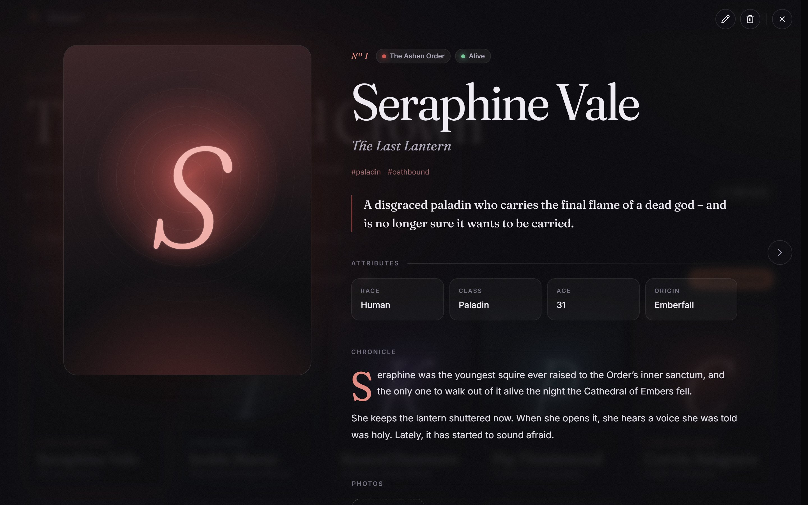
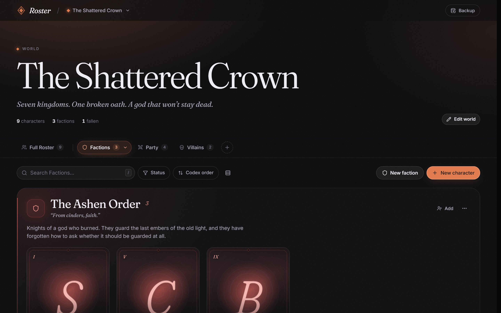

# Roster

A character codex for tabletop campaigns, novels and game worlds. Keep every world you've
built, and everyone in it: portraits, factions, parties, backstories and photo galleries,
stored locally in your browser and installable as a desktop app.



## Features

- **Worlds → tabs → characters.** Every world has a Full Roster that always contains
  everyone, a Factions board, and as many custom tabs (Party, Villains, …) as you like.
  A character can sit in several tabs; removing them from one never deletes them.
- **Rich profiles.** Epithet, status, tags, attributes, a chronicle, and a photo
  collection where the starred photo becomes the card portrait. Browse profiles with the
  arrow keys.
- **Factions** with their own color, motto and description, which tint every member's
  card and profile.
- **Search, filter and sort** within any tab.
- **Undo** on every delete.
- **Local-first.** Everything, images included, lives in IndexedDB. No account, no server.
- **Backups.** Export everything to a single `.json` file and import it back, either
  replacing your data or merging into it. Merging updates records that already exist
  instead of duplicating them.
- **Installable** as a desktop app that works offline.

<table>
  <tr>
    <td></td>
    <td></td>
  </tr>
</table>

## Getting started

Requires Node 20.19+ or 22.12+.

```bash
npm install
npm run dev
```

Open http://localhost:5173 and pick **Explore a sample world** to see how it fits together.

| Script | What it does |
| --- | --- |
| `npm run dev` | Dev server with hot reload |
| `npm run build` | Type-check and build to `dist/` |
| `npm run app` | Build, serve at http://roster.localhost:4747 and open it |
| `npm run preview` | Serve an existing build without rebuilding |
| `npm run lint` | Lint with oxlint |
| `npm run icons` | Regenerate the app icons in `public/icons/` |

## Installing it as an app

```bash
npm run app
```

In Edge or Chrome, click **Install** in the address bar (or ⋯ › Apps › Install Roster).
You get a Start menu entry and a window you can pin to the taskbar, with the top bar
drawn into the title bar on Windows.

- **It works offline.** A service worker caches the whole app, so once it's installed you
  can stop the server and Roster still opens.
- **Updating:** run `npm run app` again and open Roster. It offers to reload into the new
  version; otherwise the update applies the next time every Roster window is closed.
- **Data belongs to the address.** IndexedDB is scoped to an origin, so the installed app
  and `npm run dev` each keep their own data. Use **Backup › Export** and **Import** to
  move worlds between them. Don't change `APP_HOST` or `APP_PORT` in `vite.config.ts`
  after installing, or the app will open empty.

## Keyboard shortcuts

| Key | Action |
| --- | --- |
| `/` | Search |
| `N` | New character |
| `←` `→` | Previous / next profile |
| `E` | Edit the open profile |
| `Esc` | Close |
| `Ctrl` + `Enter` | Save |

## How the data fits together

```
World ─┬─ Tab (kind: roster | factions | collection)
       ├─ Faction
       ├─ Character ── portraitId / galleryIds → Image (Blob)
       └─ Membership (tabId + characterId)   ← only for collection tabs
```

- **The Full Roster is derived, not stored.** It's every character in the world, so
  anything created from any tab shows up there instantly. It can't be deleted.
- **Collection tabs** hold memberships, which is why a character can appear in many tabs.
- **A character belongs to at most one faction.**
- **Deletes return a snapshot** of the rows they touched, which is how undo works.
- **Photos are downscaled to WebP** before they're stored.

## Project structure

```
src/
  db/          schema, types, every write (actions.ts), live-query hooks, images, backup, seed
  ui/          design-system primitives: Button, Modal, Menu, ImageDrop, toasts and confirm
  components/  character card, profile, editor and picker; factions board
  world/       world page pieces: tab bar, toolbar, editors, context
  pages/       WorldsPage, WorldPage
  shell/       top bar, page transitions, app update prompts
  styles/      design tokens and global styles
scripts/       icon generation
```

## Built with

React 19, TypeScript, Vite, [Dexie](https://dexie.org) (IndexedDB) with live queries,
[Motion](https://motion.dev) for layout and shared-element animations, React Router,
CSS Modules, and [vite-plugin-pwa](https://vite-pwa-org.netlify.app) for the service worker.

## Roadmap

Moving storage to a Node API (SQLite for records, images as files) so worlds can sync
between devices. All writes already go through `src/db/actions.ts` and all reads through
`src/db/hooks.ts`, so the switch is contained to those two files; the shapes in
`src/db/types.ts` stay the same.
